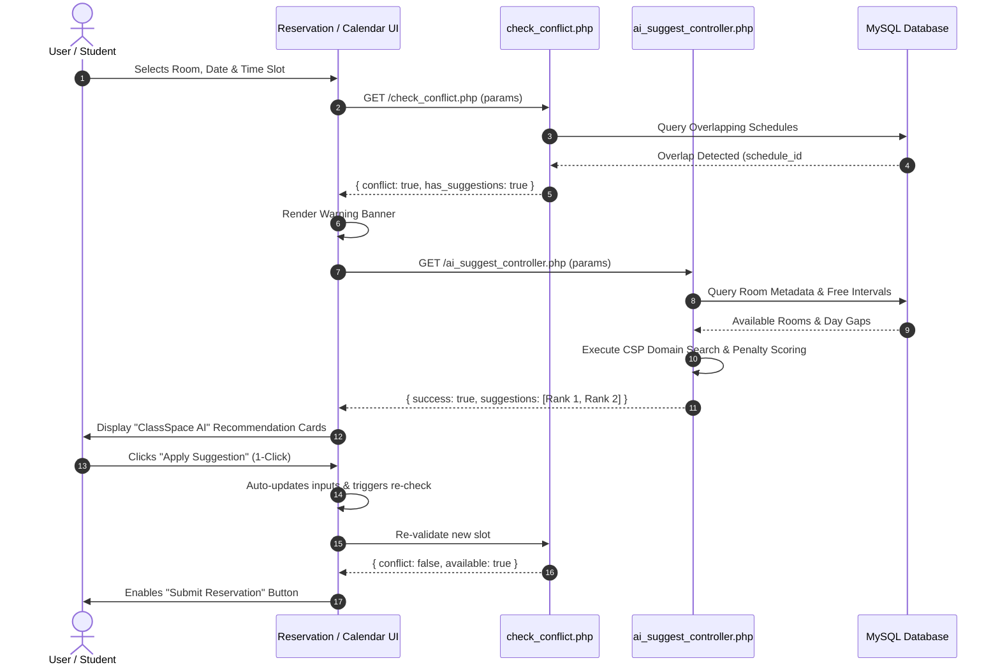

# Academic Technical Documentation: AI-Based Conflict Detection & Constraint Satisfaction Recommendation System

> **Document Type:** Research Methodology & Architectural Specification  
> **Target Sections:** Chapter III (System Architecture, Algorithms & Theoretical Framework) & Chapter IV (System Implementation)  
> **Institutional Context:** First City Providential College — College of Computer Studies  
> **Project:** Web-Based Room Allocation and Reservation System (ClassSpace)  
> **Theoretical Grounding:** Constraint Satisfaction Problem (CSP) Theory & Heuristic Search  

---

## 1. Theoretical Framework: Constraint Satisfaction Problem (CSP)

### 1.1 Conceptual Background
In classical Artificial Intelligence (Russell & Norvig, 2021), scheduling and timetabling problems are formally categorized as **Constraint Satisfaction Problems (CSPs)**. Unlike unconstrained search or purely probabilistic models, a CSP guarantees **100% mathematical validity** by systematically exploring a state space defined by discrete variables, allowable domains, and governing constraints.

In **ClassSpace**, classroom conflict resolution is structured as an optimization CSP: when a user’s initial reservation request violates schedule collision constraints (resulting in a conflict), the system does not terminate with an error; instead, it executes a CSP heuristic solver to find alternative state assignments that satisfy all operational constraints while minimizing deviation from the user’s original preferences.

---

## 2. Mathematical Modeling of the ClassSpace CSP

A CSP is formally represented as a 3-tuple:
$$\text{CSP} = \langle X, D, C \rangle$$

### 2.1 Set of Variables ($X$)
The variables represent the scheduling attributes to be assigned:
1. $X_{\text{room}} \in \mathbb{N}$: The target room identifier (`room_id`).
2. $X_{\text{start}} \in \mathcal{T}$: The reservation start timestamp (24-hour format).
3. $X_{\text{end}} \in \mathcal{T}$: The reservation end timestamp, defined as $X_{\text{end}} = X_{\text{start}} + \Delta t$, where $\Delta t$ is the user's requested reservation duration.
4. $X_{\text{date}} \in \mathcal{D}$: The designated calendar date (or weekday $X_{\text{dow}}$ for recurring weekly schedules).

### 2.2 Domain Definitions ($D$)
The domain defines the allowable values each variable can take:
* **Operating Hours Domain ($D(X_{\text{start}})$):** Discretized into 30-minute intervals across institutional operating hours (07:00 to 21:00):
  $$D(X_{\text{start}}) = \{ \text{07:00}, \text{07:30}, \text{08:00}, \dots, (21:00 - \Delta t) \}$$
* **Room Domain ($D(X_{\text{room}})$):** The set of registered campus facilities:
  $$D(X_{\text{room}}) = \{ r \in \text{Rooms} \mid \text{Status}(r) = \text{'available'} \}$$
  *Initial search space:* Scoped to the same building/hall ($H_{\text{req}}$).  
  *Relaxed search space:* Expanded campus-wide if localized domain yields fewer than two valid solutions.
* **Duration ($\Delta t$):** Fixed constraint derived from the user request:
  $$\Delta t = T_{\text{end\_req}} - T_{\text{start\_req}}$$

---

### 2.3 Constraint Hierarchy ($C$)

Constraints are partitioned into **Hard Constraints** (mandatory feasibility criteria) and **Soft Constraints** (preference optimization criteria).

#### A. Hard Constraints ($C_{\text{hard}}$)
A candidate state $\sigma = (X_{\text{room}}, X_{\text{start}}, X_{\text{end}}, X_{\text{date}})$ is valid **if and only if** all hard constraints evaluate to true:

1. **Boundary Operating Constraint:**
   $$\text{07:00} \le X_{\text{start}} < X_{\text{end}} \le \text{21:00}$$
2. **Facility Readiness Constraint:**
   $$\text{OperationalStatus}(X_{\text{room}}) = \text{'available'}$$
3. **Minimum Capacity Threshold:**
   $$\text{Capacity}(X_{\text{room}}) \ge \text{Capacity}_{\text{target}}$$
4. **Collision-Free Overlap Condition (Non-Overlapping Interval Math):**  
   For every existing schedule record $s \in (\mathcal{S}_{\text{approved}} \cup \mathcal{S}_{\text{pending}})$ on room $X_{\text{room}}$ on date $X_{\text{date}}$:
   $$\neg (s.\text{start} < X_{\text{end}} \land s.\text{end} > X_{\text{start}})$$
   *Equivalently: $X_{\text{end}} \le s.\text{start} \lor X_{\text{start}} \ge s.\text{end}$.*

---

#### B. Soft Constraints & Heuristic Penalty Function ($C_{\text{soft}}$)
When multiple candidates satisfy all hard constraints, a **Heuristic Distance Function** scores and ranks each candidate. The objective is to minimize total deviation penalty:

$$\min \mathcal{J}(\sigma) = w_1 \cdot \Delta_{\text{time}} + w_2 \cdot \Delta_{\text{hall}} + w_3 \cdot \Delta_{\text{capacity}} + w_4 \cdot \Delta_{\text{amenity}}$$

Where:
* $\Delta_{\text{time}} = |X_{\text{start}} - T_{\text{start\_req}}|$ (Time difference in minutes). Weight $w_1 = 1.0$.
* $\Delta_{\text{hall}} = 1$ if $\text{Hall}(X_{\text{room}}) \ne H_{\text{req}}$, else $0$. Weight $w_2 = 60.0$ (equivalent to a 60-minute time penalty).
* $\Delta_{\text{capacity}} = \text{Capacity}(X_{\text{room}}) - \text{Capacity}_{\text{target}}$ (penalizes excessive capacity waste). Weight $w_3 = 0.5$.
* $\Delta_{\text{amenity}} = 1$ if requested amenities (e.g., Air Conditioning) are not matched, else $0$. Weight $w_4 = 40.0$.

**Ranking Rule:** Candidate with $\min \mathcal{J}(\sigma)$ is assigned **Rank #1**.

---

## 3. Algorithmic Specifications

### 3.1 Algorithm 1: Conflict Detection Algorithm
```text
Algorithm: Automated Conflict Detection
Input: room_id, reservation_type, date, dow, start_time, end_time
Output: conflict_status (Boolean), conflicting_time_range, has_suggestions

1. Validate input format (room_id > 0, start_time < end_time, valid date/dow).
2. If invalid: return error "invalid_input".
3. Initialize existing_schedules query:
   If reservation_type == 'one-time':
       dow_of_date = DayName(date)
       query = SELECT schedule_start, schedule_end FROM schedule
               WHERE room_id = :room_id AND (
                   (schedule_day = :date AND schedule_start < :end AND schedule_end > :start)
                   OR
                   (schedule_day IS NULL AND LOWER(schedule_day_of_week) = :dow_of_date 
                    AND schedule_start < :end AND schedule_end > :start)
               )
   Else (reservation_type == 'weekly'):
       query = SELECT schedule_start, schedule_end FROM schedule
               WHERE room_id = :room_id AND (
                   (schedule_day IS NULL AND LOWER(schedule_day_of_week) = :dow 
                    AND schedule_start < :end AND schedule_end > :start)
                   OR
                   (schedule_day >= CURDATE() AND DAYNAME(schedule_day) = :dow 
                    AND schedule_start < :end AND schedule_end > :start)
               )
4. Execute query against database.
5. If record found:
       return { conflict: true, start: record.start, end: record.end, has_suggestions: true }
   Else:
       return { conflict: false, available: true }
```

---

### 3.2 Algorithm 2: Constraint Satisfaction–Based Slot Suggestion Algorithm (CSP)
```text
Algorithm: Heuristic CSP Slot & Room Recommender
Input: room_id, date, dow, start_time, end_time, type, requested_duration
Output: ranked_suggestions (Array of top 2-3 recommendations)

1. candidates = []
2. target_room = RetrieveRoomDetails(room_id)
3. operating_start = 07:00, operating_end = 21:00

// PHASE 1: Same-Room Alternative Slot Search (Free-Gap Analysis)
4. busy_intervals = RetrieveBookings(room_id, date, dow)
5. merged_busy = MergeOverlappingIntervals(busy_intervals)
6. free_gaps = InvertIntervals(merged_busy, operating_start, operating_end)
7. For each gap in free_gaps:
       If Duration(gap) >= requested_duration:
           candidate_start = gap.start
           While (candidate_start + requested_duration) <= gap.end:
               candidates.append({
                   type: 'alternative_slot',
                   room_id: target_room.id,
                   room_name: target_room.name,
                   hall_name: target_room.hall_name,
                   start: candidate_start,
                   end: candidate_start + requested_duration,
                   capacity: target_room.capacity,
                   has_ac: target_room.has_ac
               })
               candidate_start = candidate_start + 30 minutes

// PHASE 2: Alternative Room Search (Constraint Relaxation)
8. peer_rooms = RetrieveRoomsInHall(target_room.hall_id, min_capacity = target_room.capacity)
9. For each peer in peer_rooms:
       If peer.id != target_room.id AND peer.status == 'available':
           conflict = CheckConflict(peer.id, date, dow, start_time, end_time)
           If NOT conflict:
               candidates.append({
                   type: 'alternative_room',
                   room_id: peer.id,
                   room_name: peer.name,
                   hall_name: peer.hall_name,
                   start: start_time,
                   end: end_time,
                   capacity: peer.capacity,
                   has_ac: peer.has_ac
               })

// PHASE 3: Heuristic Scoring & Ranking
10. For each candidate in candidates:
        penalty = ComputePenalty(candidate, target_room, start_time)
        candidate.score = penalty

11. Sort candidates in ascending order of candidate.score
12. Return Top 3 candidates with generated AI rationale explanations.
```

---

## 4. System Architecture & Component Interaction Flow



---

## 5. Defense & Evaluation Talking Points

When presenting this module during oral defense:
1. **Determinism vs. Hallucination:** Point out that pure neural networks/LLMs cannot be trusted with relational database integrity because they hallucinate availability. By using **Constraint Satisfaction Problem (CSP)** formulation, the system guarantees 100% mathematical validity.
2. **Computational Complexity:** The CSP algorithm runs in $O(N \cdot M)$ where $N$ is candidate rooms and $M$ is intervals (max 28 per day), completing in **$< 15\text{ms}$** without server strain.
3. **Academic Relevance:** Emphasize that CSP is a foundational pillar of Artificial Intelligence, directly addressing Objective 2.c of the thesis paper.
